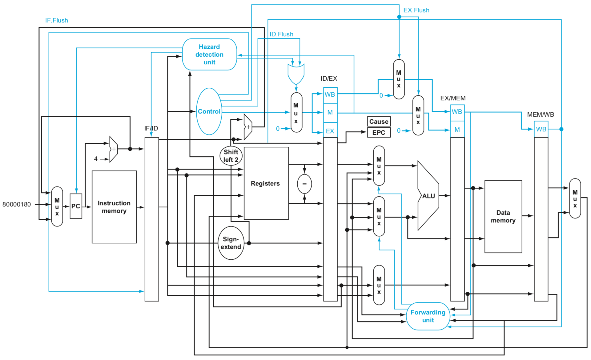

View the Verilog implementation of the processor:

`mips_basic_pipeline.v` is a basic implementation without forwarding actually built in. 

[Basic Processor](mips_pipeline_newest.srcs/sources_1/new/mips_basic_pipeline.v)

[Forwarding Processor](mips_pipeline_newest.srcs/sources_1/new/mips_forwarding_pipeline.v)

`mips_forwarding_pipeline.v` includes a 5-stage pipeline with full forwarding from the ALU and data memory, as well as detection and correction of various hazards that may occur.

Here is a high-level layout of the processor design that I used:

This is a basic implementation and does not implement all instructions in the MIPS architecture.

Picture credits to the Computer Organization and Design, 5th Edition textbook.
